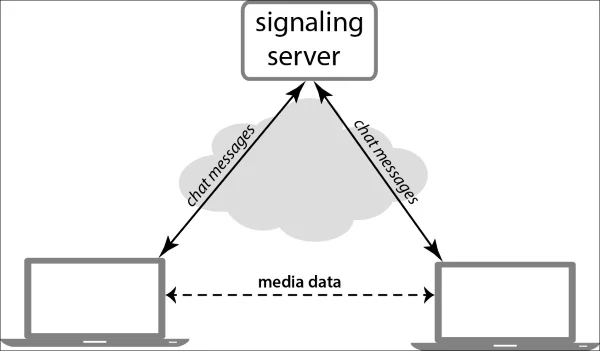

# Web RTC Demo using  PeerJS

### WebRTC
WebRTC stands for Web Real-Time Communication. It supports peer-to-peer communication without a server in between, allowing audio, video and data to be exchanged between connected peers. With WebRTC, the server's role is limited to helping two peers discover each other and establish a direct connection.

With WebRTC, all of this comes built-in into the browser out-of-the-box. WebRTC automatically handles all of these concerns under the hood.This technology doesn’t need any plugins or third-party software. It is open-sourced and its source code is freely available at [WebRTC.org ](https://webrtc.org/).

### WebRTC APIs
WebRTC consists of several interrelated APIs and protocols which work together to achieve Real-Time Communication. The most important APIs are

* ``getUserMedia():`` capture audio and video.
* ``MediaRecorder:`` record audio and video.
* ``RTCPeerConnection:`` stream audio and video between users.
* ``RTCDataChannel:`` stream data between users.

### Signaling (In this demo I depend on PeerServer Cloud service [link](https://peerjs.com/peerserver) )
Signaling refers to the mechanism/server that coordinates the initial communication and allows metadata to be sent between peers (browser). Therefore, peers first communicate with each other through signaling server - mainly to discover other peers and exchange the information needed to establish a direct connection between them. Once a direct connection is established, signaling no longer works.

Sources
* [MDN Web Docs ](https://developer.mozilla.org/en-US/docs/Web/API/WebRTC_API)
* [WebRTC.org ](https://webrtc.org/)
* [Wikipedia ](https://en.wikipedia.org/wiki/WebRTC)